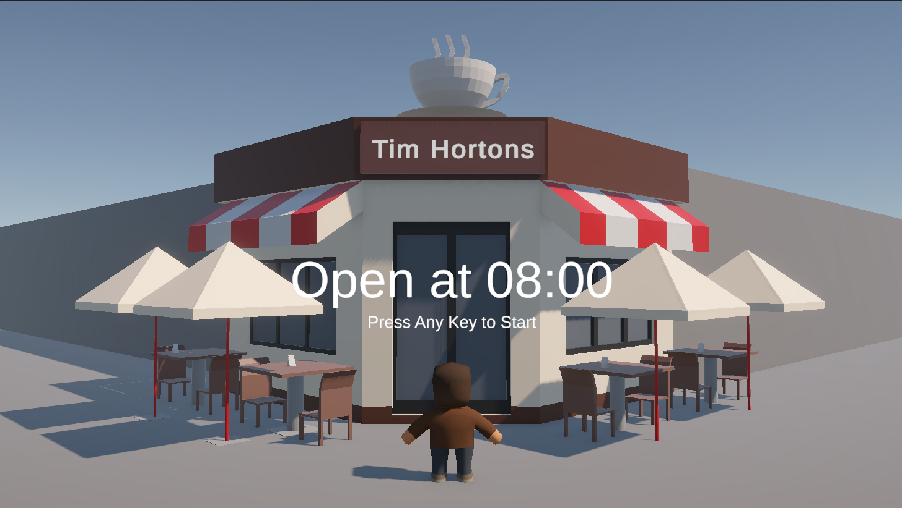
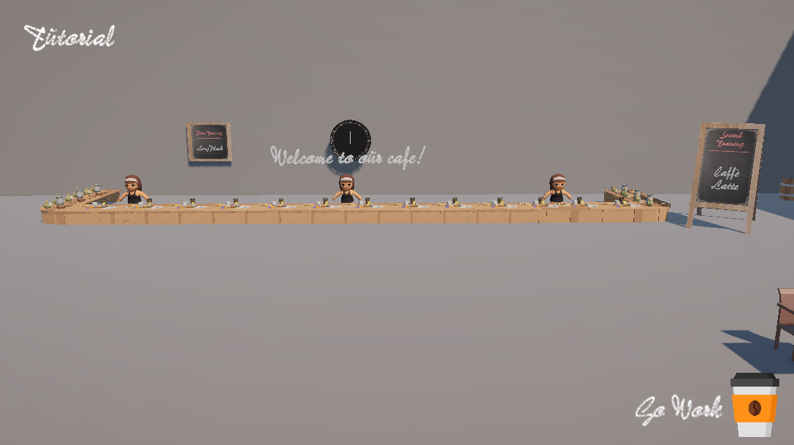
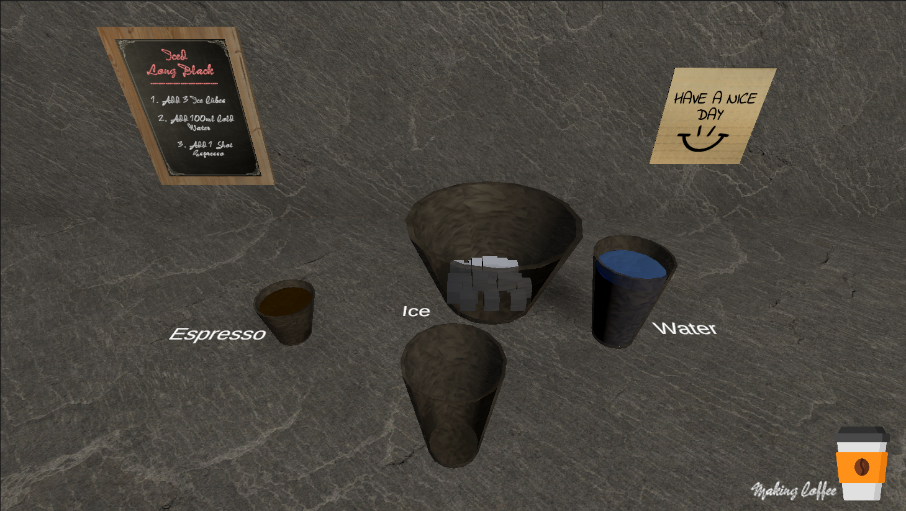
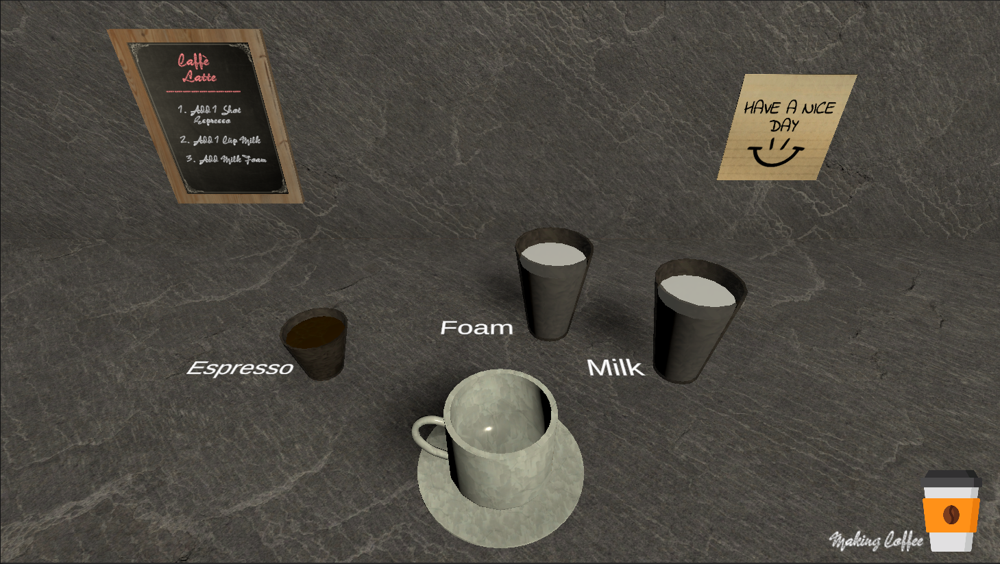
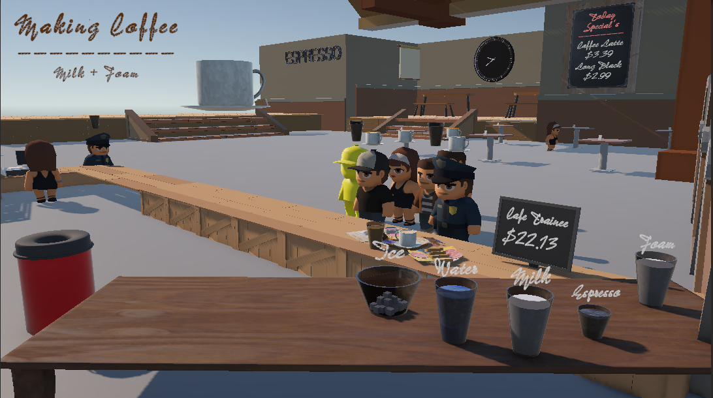
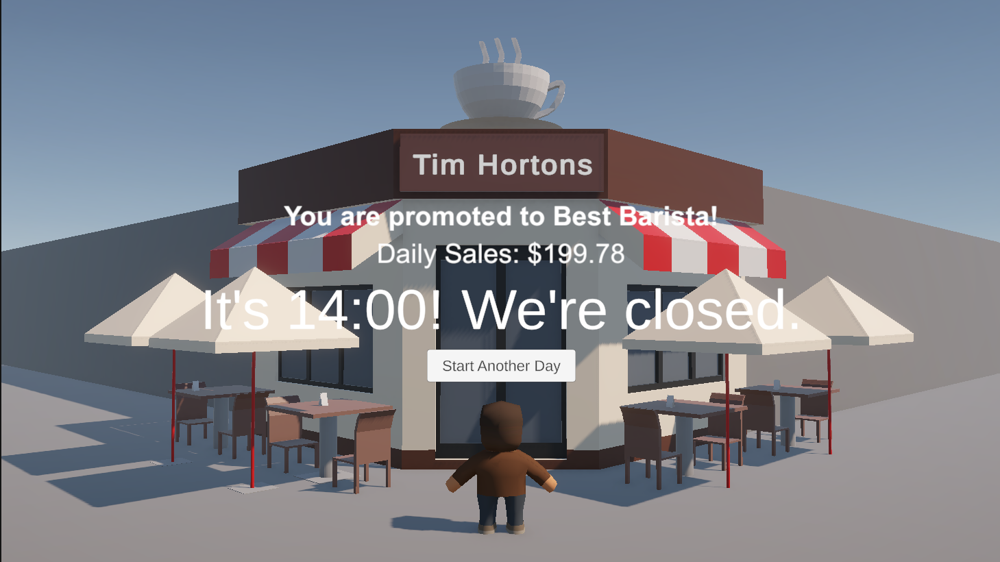

# CoffeeGuru
- Demonstration Video:https://www.youtube.com/watch?v=S_MBiHWrwnI
- WebGL Version Available (PC): https://yobisaboy.itch.io/la-la-latte-coffee-guru
- Unity Project & Data Collect: https://github.com/yoyohohoh/COMP395_GroupProject/tree/game

## Introduction
The game is set in a stylized café environment designed to educate players on coffee preparation and customer flow management. Players interact with prep stations, ingredient zones, and a pickup counter to simulate real-world café operations.

## How to Run
Pull everything from this GitHub, after downloading, run `La La Latte Coffee Guru.exe` to start the game.

## Game Scene
### Game Start

### Tutorial: Lobby

### Tutorial: Iced Long Black

### Tutorial: Caffe Latte

### Game Level 

### Game Over

## Contact
- Tel: +1 (647) 637-0831
- Email: hoyiuyiuyoyo@gmail.com
- LinkedIn: https://www.linkedin.com/in/yoyoho
- Portfolio: https://yobisaboy.github.io/Portfolio
